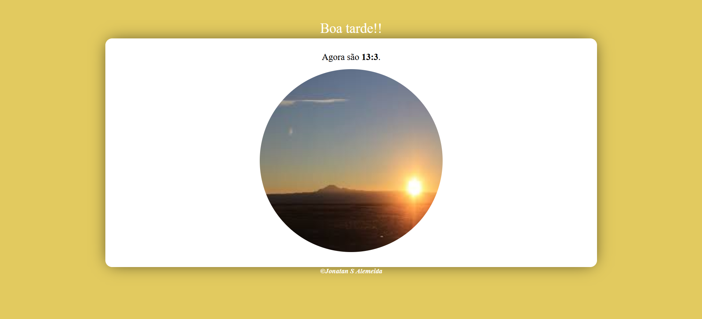

# Que horas é?

Projeto realizado no curso Curso de JavaScript do canal Curso em video.   
Instrutor: Guanabara
  

Aqui foi meu primeiro contato com javascript, nesse projeto a imagem e a cor de fundo troca de acordo com o horário do dia.

## ⚙️ Tecnologias utilizadas

- HTML 
- CSS  
- JavaScript
- Git e Github

## 🧾 Contato

Email: jonatankalmeidakk28@gmail.com  
WhatsApp: (49) 9 8435-6670
